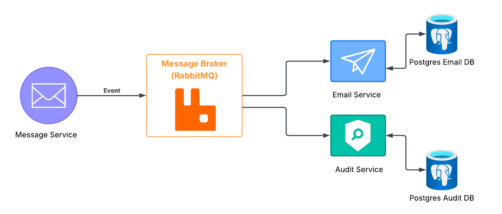
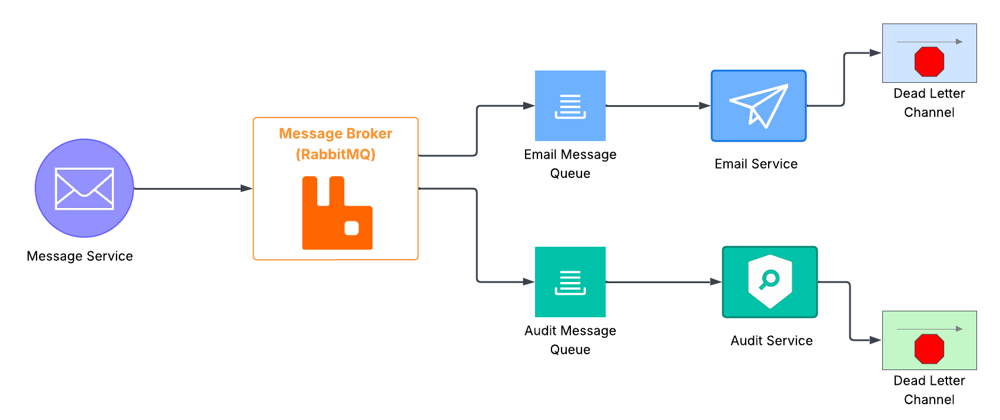

# Architecture
This project will consist of a publisher, the Message service and two subscribers, the Email and Audit services. Events from the Message service will be published to a RabbitMQ message broker. RabbitMQ routes these events to the appropriate queues, where they are consumed asynchronously by the Email and Audit services

## Architecture Diagram

## Message Service
The Message Service provides the core functionality for creating and interacting with messages. Similar to typical email systems, users can perform the following actions:
- Create a new message
- Retrieve existing messages
- Add or remove message labels
- Acknowledge a message
- Mark a message as read

Each operation publishes a corresponding event to RabbitMQ for processing.

## Email Service
The Email Service provides functionality for sending email notifications to registered users. It consumes New Message events from RabbitMQ and sends notification emails to the appropriate recipients.

To receive such notifications, users must first register an email associated with their messaging account.

## Audit Service
The Audit Service provides functionality for auditing message events. Primarily, events can be retrieved via the following filters:
- Event ID
- Event type
- Sender username
- Recipient username
- Event Time within:
    - last 24 hours
    - last month
    - last year

## RabbitMQ
RabbitMQ acts as the message broker and is responsible for facilitating asynchronous communication between the Message Service and its subscribers (Email, Audit Service). Rather than communicating directly, the Message Service publishes message-related events to the RabbitMQ topic.

Each subscriber service maintains its own queue and consume events independently. Events are routed to the queues according to the following routing strategy:
- `message.created` → Email Queue, Audit Queue
- `message.read` → Audit Queue
- `message.acknowledged` → Audit Queue
- `message.label.added` → Audit Queue
- `message.label.removed` → Audit Queue

Each queue is configured with automatic retry logic. Messages that exceed the maximum retry count are rerouted to a Dead-Letter Queue (DLQ)

